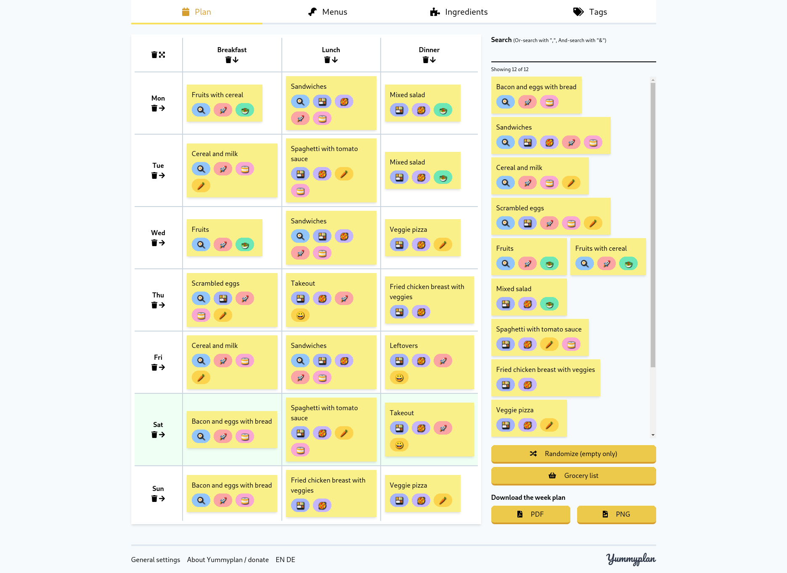
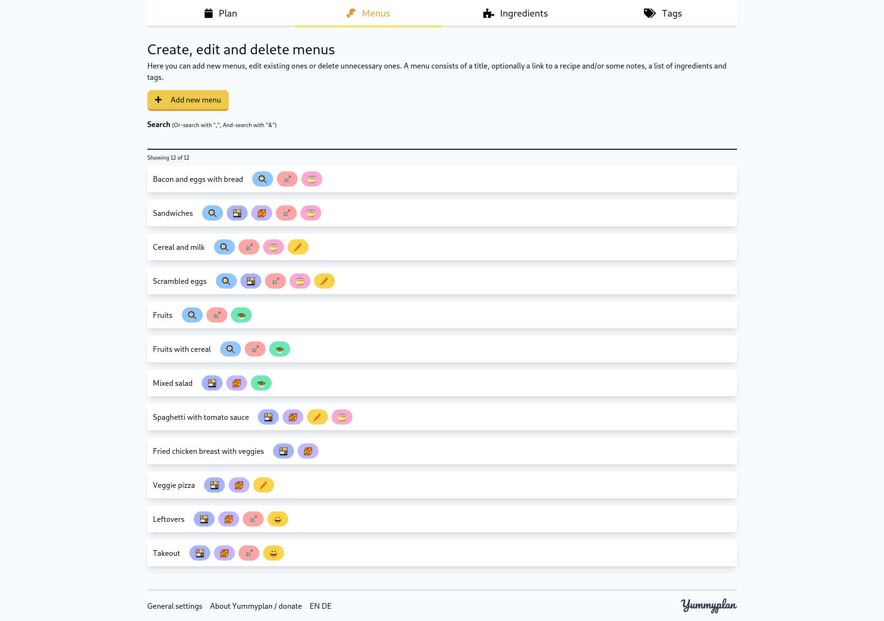
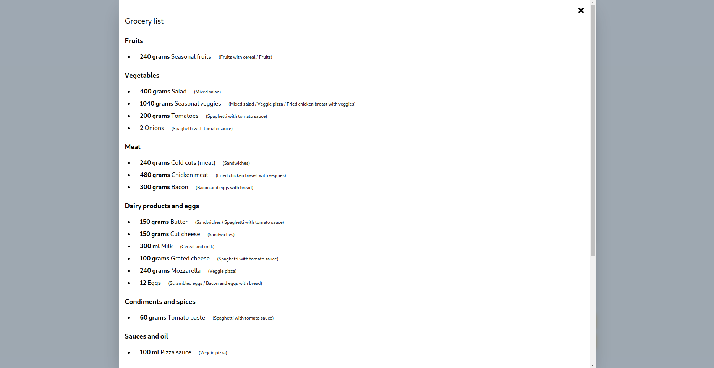
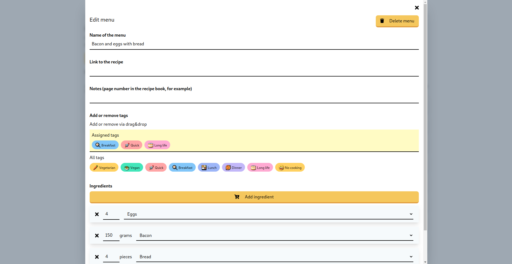

<p align="center">
    
</p>

# Yummyplan

> A meal planning app for an entire week

## What is Yummyplan?

Yummyplan is an app that allows you to plan a week worth of meals for your household via drag and drop. Create, edit 
and delete meals, assign ingredients and tags to them and download the plan as PDF or PNG. 

Out of ideas for meals? Use the "Random" button to assign random meals to empty slots! The random meals follow a set of 
allowed tags for each day and meal time.

Done with your plan and need to go grocery shopping? A sorted consolidated grocery list is available, too!

No login or account is required, since everything is saved in your browser.

Some default content is available in both german and english, but own meals and ingredients can be added.

Check it out here: [yummyplan.github.io](https://yummyplan.github.io)

### Some screenshots

| Week plan                                                                    | Editing meals                                                              |
| ---------------------------------------------------------------------------- | -------------------------------------------------------------------------- |
| [](./doc/weekplan.png)          | [](./doc/mealoverview.png) |
| [](./doc/grocerylist.png) | [](./doc/editmeal.png)          |

## Build Setup

```bash
# install dependencies
$ npm run install

# serve with hot reload at localhost:3000
$ npm run dev

# generate static project
$ npm run generate
```

For detailed explanation on how things work, check out [Nuxt.js docs](https://nuxtjs.org).

## Run tests

```bash
# install dependencies
$ npm run install

$ npm run test
```

or:

```bash
# install dependencies
$ npm run install

$ npm run test-watch
```

## Contribute

If you want to contribute a new feature, or if you've found a bug, please open a pull request or an issue in this repository.
